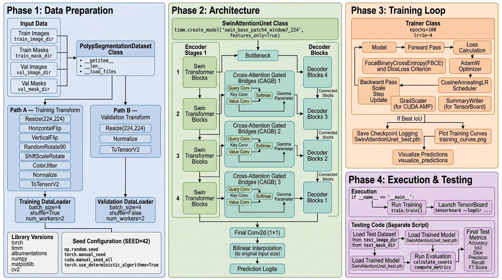
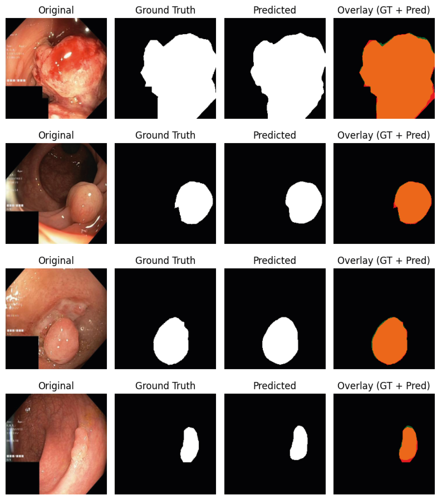

# Polyp-segmenation-Cross-Attention-Gated-Bridge

### Dataset Link:
https://datasets.simula.no/kvasir/

# Run the project
```bash
conda create -n your_env_name python==3.10 -y
```

```bash
conda activate your_env_name
```

```bash
https://github.com/MannShrestha/Polyp-segmenation-Cross-Attention-Gated-Bridge.git
```

```bash
pip install -r requirements.txt
```

# Data Sample
https://github.com/MannShrestha/Polyp-segmenation-Cross-Attention-Gated-Bridge/blob/main/images/input-image.png

# Code workflow


# Swin Attention Unet Output

